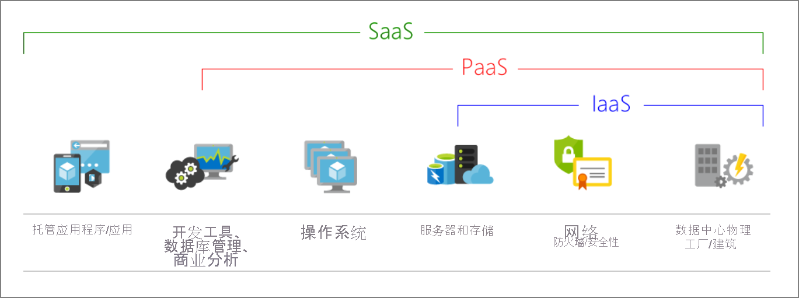
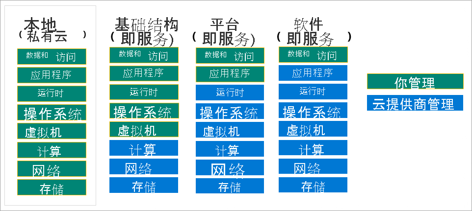
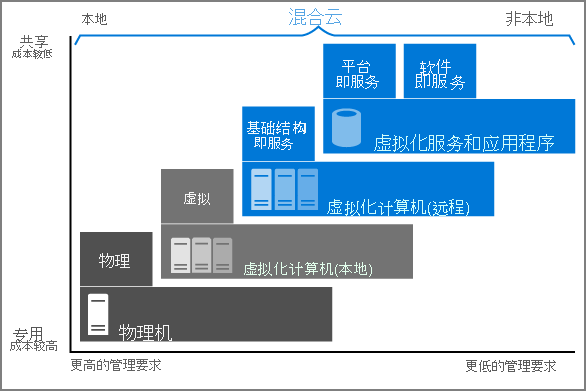
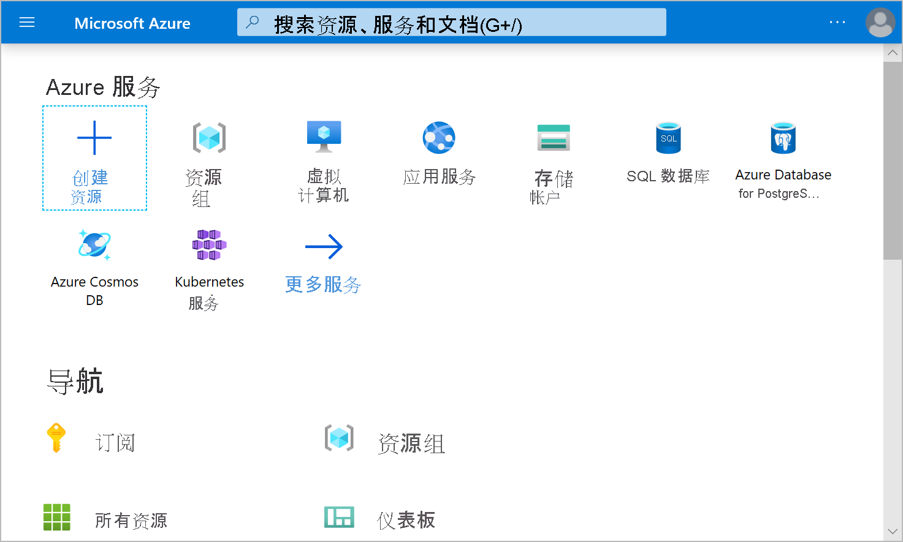
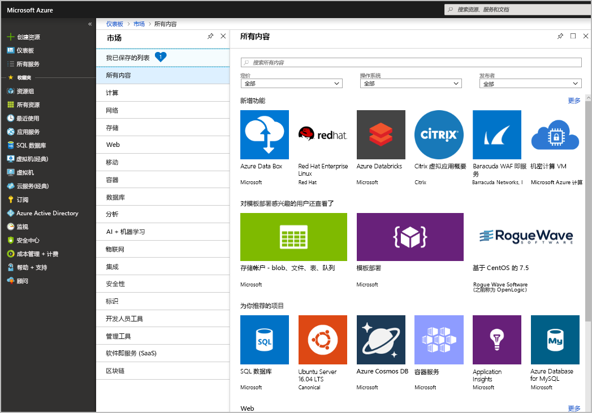

## Azure是什么

Azure 是一个云计算平台，提供一系列不断扩展的服务，可帮助你构建解决方案来满足业务目标。 Azure 服务范围很广，涵盖从简单的 Web 服务（用于在云中托管业务）到运行完全虚拟化的计算机（用于运行自定义软件解决方案）等各种服务。 
Azure 提供大量基于云的服务，如远程存储、数据库托管和集中式帐户管理。 
Azure 还提供 AI 和物联网 (IoT) 等新功能。

## 什么是云计算

这是通过 Internet（也称为云）提供计算服务。

### 云计算有哪些优势？

* 可靠性：根据你选择的服务级别协议，基于云的应用程序可以提供持续的用户体验，即使在出现故障时也不会有明显的停机时间。

* 可伸缩性：可通过两种方式缩放云中的应用程序，同时利用自动缩放功能：

    纵向：可以通过向虚拟机中添加 RAM 或 CPU 来增加计算容量。
    横向：可以通过添加资源实例（例如，将更多虚拟机添加到配置中）来增加计算能力。

* 弹性：基于云的应用程序可配置为始终拥有所需的资源。

* 敏捷性：根据应用程序需求的变化，可以快速部署和配置基于云的资源。

* 地区分发：可以将应用程序和数据部署到全球各地的区域数据中心，使客户在其区域中始终具有最佳性能。

* 灾难恢复：通过利用基于云的备份服务、数据复制和地理分布，你可以放心地部署应用程序，因为你知道在发生灾难时数据是安全的。

### 什么是云服务模型？

| 计算模型 | 说明 |
|---|---|
| IaaS | 这种云服务模型最接近于管理物理服务器。 云提供商将保持硬件是最新的，而操作系统维护和网络配置则需要云租户完成。 例如，Azure 虚拟机是在 Microsoft 数据中心中运行的完全可操作的虚拟计算设备。 这种云服务模型的优点是快速部署新的计算设备。 设置新虚拟机比采购、安装和配置物理服务器快得多。 |
| PaaS | 这种云服务模型是一种托管主机环境。 云提供商管理虚拟机和网络资源，云租户将其应用程序部署到托管主机环境中。 例如，Azure 应用服务提供托管的主机环境，开发人员可在其中上传其 Web 应用程序而无需担心物理硬件和软件要求。|
| SaaS | 在这种云服务模型中，云提供商管理应用程序环境的所有方面，如虚拟机、网络资源、数据存储和应用程序。 云租户只需向由云提供商管理的应用程序提供数据。 例如，Office 365 提供在云中运行的 Office 的完全可用版本。 你只需创建内容，Office 365 会处理其他所有事项。|

下图展示了云提供商与云租户之间的不同级别责任:

### 什么是无服务器计算？

与 PaaS 重叠，无服务器计算使开发人员无需管理基础结构，从而能够更快地构建应用程序。 

### 什么是公有云，私有云和混合云？

| 部署模型 | 说明 |
| :------- |:---- |
| 公有云   | 通过公共 Internet 提供服务，可供任何想要购买的人使用。 云资源（如服务器和存储）为第三方云服务提供商所有且由其运营，并通过 Internet 提供。 |
| 私有云   | 计算资源专供某个企业或组织的用户使用。 私有云可实际位于组织的现场数据中心。 它也可以由第三方服务提供商托管。                              |
| 混合云   | 这种计算环境通过实现公有云和私有云之间的数据和应用程序共享，将公有云和私有云结合在一起。|

## 什么是 Azure?

Azure 是一系列持续扩展的云服务，可帮助组织迎接当前和未来的业务挑战。 Azure 让你能够使用喜爱的工具和框架在大规模全球性网络上随意生成、管理和部署应用程序。

### Azure 提供什么内容？

* 为未来做好准备： Microsoft 提供的持续创新为你当前的开发以及未来产品的规划和实现提供支持。
* 根据需要进行构建： 你有多种选择。 凭借对开放源代码的承诺以及对所有语言和框架的支持，你可按需要的方式进行构建，并在所需位置进行部署。
* 无缝混合操作： 本地、云中和边缘 - 无论你在那里，我们都能满足你的需要。 利用专为混合云解决方案设计的工具和服务，集成和管理你的环境。
* 信任你的云： 获得自始至终的安全性，由专家团队提供支持，实现企业、政府和初创企业都信任的主动合规性。

### 我可以利用 Azure 实现什么目的？

Azure 提供超过 100 种服务，可用于执行从在虚拟机上运行现有应用程序到探索新的软件范例（如智能机器人和混合现实）的各项操作。

### Azure 如何工作？

<figure class="video_container">
  <iframe src="https://www.microsoft.com/zh-cn/videoplayer/embed/RWlzQ6?postJsllMsg=true&autoCaptions=zh-cn" frameborder="0" allowfullscreen="true"> </iframe>
</figure>

### 什么是 Azure 门户？(Portal)

Azure 门户是基于 Web 的统一控制台，提供可替代命令行工具的方法。 通过 Azure 门户，可以使用图形用户界面来管理 Azure 订阅。

<figure class="video_container">
  <iframe src="https://www.microsoft.com/zh-cn/videoplayer/embed/RE4ICN6?postJsllMsg=true&autoCaptions=zh-cn" frameborder="0" allowfullscreen="true"> </iframe>
</figure>

### 什么是 Azure 市场？

<https://azuremarketplace.microsoft.com/en-us>

可帮助用户与 Microsoft 合作伙伴、独立软件供应商和初创企业建立联系；后者提供的解决方案和服务均经过优化，可在 Azure 上运行。 通过 Azure 市场，客户可查找、试用、购买和预配来自数百家领先服务提供商的应用程序和服务。 所有解决方案和服务都经过认证，可在 Azure 上运行。

